# Sehiyye-Data-Analizi
Sehiyye datasinin R ile analizi

# Səhiyyə Məlumatlarının Analizi

## Layihənin Məqsədi
Bu layihədə səhiyyə məlumatları üzərində deskriptiv analiz, korrelyasiya analizi, anomaliya aşkarlanması, proqnozlaşdırma və hipotez testləri həyata keçirilmişdir.

---

## Deskriptiv Analiz 

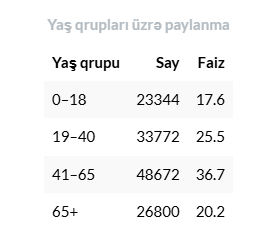

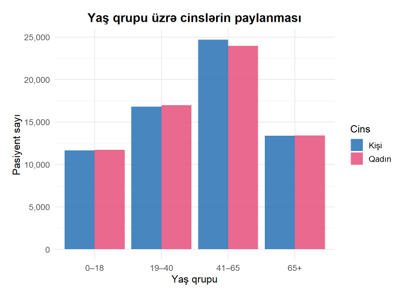

Bu hissədə pasiyentlərin yaş strukturu analiz olunub. Nəticələr göstərir ki, sistemdə ən böyük pasiyent qrupu 41–65 yaş aralığıdır və ümumi datasetin 36.7%-ni təşkil edir.

Bu onu göstərir ki, tibbi müraciətlərin əsas hissəsi orta yaş qrupunda cəmləşir. Yəni insanlar yaş artdıqca daha çox tibbi nəzarətə və müayinəyə ehtiyac duyurlar.

19–40 yaş qrupu da yüksək paya sahibdir. Bu yaşlarda müraciətlər daha çox ümumi müayinələr və gündəlik sağlamlıq xidmətləri ilə əlaqəli ola bilər.

65 yaşdan yuxarı pasiyentlərin payının yüksək olması isə vacib göstəricidir. Çünki bu yaş qrupunda davamlı nəzarət və müalicə ehtiyacı daha çox olur.

Qrafikdə 0 yaşlı pasiyentlərin görünməsinin əsas səbəbi isə datasetdə bəzi körpələrin 1 yaşdan kiçik olması və 9 pasiyentin doğulduğu gün vəfat etməsi ilə əlaqəlidir. Yəni burada 0 yaş göstəricisi texniki olaraq yeni doğulmuş pasiyentləri ifadə edir.

Ümumilikdə analiz göstərir ki, yaş faktoru tibbi müraciət intensivliyinə birbaşa təsir edən əsas göstəricilərdən biridir.

Minimum yaş göstəricisinin 0 olması datasetdə doğum və ölüm tarixinin eyni günə təsadüf etdiyi, həmçinin 1 yaşdan kiçik pasiyentlərin mövcudluğu ilə əlaqədardır.

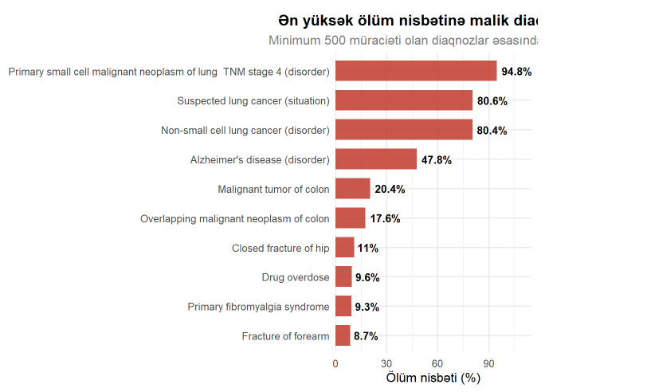

Minimum 500 müraciəti olan diaqnozlar arasında ən yüksək ölüm nisbətinə malik xəstəliklər göstərilmişdir. Nəticələrə əsasən, ağciyər xərçənginin irəliləmiş mərhələləri və şübhəli ağciyər xərçəngi hallarında ölüm riski ən yüksək səviyyədədir. Alzheimer xəstəliyi də yüksək ölüm göstəricisi ilə diqqət çəkir. Ümumilikdə analiz göstərir ki, ağır və xroniki xəstəliklər ölüm ehtimalını əhəmiyyətli dərəcədə artırır.

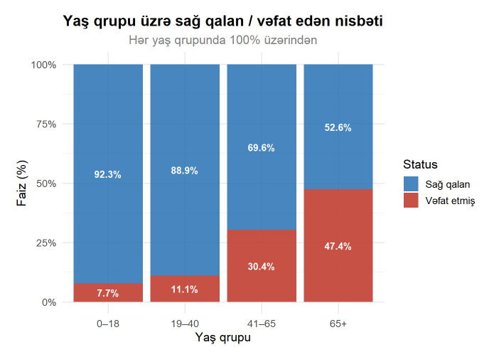

Bu hissədə pasiyentlərin ailə vəziyyəti və sağ qalma göstəriciləri analiz olunub.

Ümumi nəticələrə baxdıqda pasiyentlərin 75%-dən çoxunun sağ qaldığı, təxminən 25%-nin isə vəfat etdiyi görünür.

Yaş qrupları üzrə müqayisə etdikdə isə çox vacib bir tendensiya müşahidə olunur. Yaş artdıqca vəfat edən pasiyentlərin nisbəti də artır. Məsələn:

• 0–18 yaş qrupunda ölüm göstəricisi təxminən 8%-dir,

• 65 yaşdan yuxarı qrupda isə bu göstərici təxminən 47%-ə qədər yüksəlir.

Bu nəticə yaş faktorunun ölüm riski ilə birbaşa əlaqəli olduğunu göstərir.

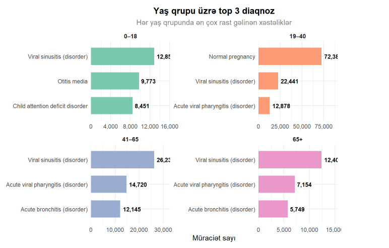

Yaş qrupları üzrə ən çox rast gəlinən üç diaqnoz təhlil edilmişdir. Nəticələr göstərir ki, viral sinusit bütün yaş qruplarında ən çox müşahidə olunan diaqnozlar sırasında yer alır və geniş yayılmış sağlamlıq problemi kimi seçilir. 19–40 yaş qrupunda normal hamiləlik müraciət sayı baxımından digər diaqnozları əhəmiyyətli dərəcədə üstələyir. 41 yaşdan yuxarı qruplarda isə yuxarı tənəffüs yolları xəstəlikləri üstünlük təşkil edir. Təhlil göstərir ki, diaqnozların paylanması yaş qrupları üzrə fərqlənir və tibbi xidmətlərə olan tələbatın strukturu yaş amilindən əhəmiyyətli dərəcədə asılıdır.

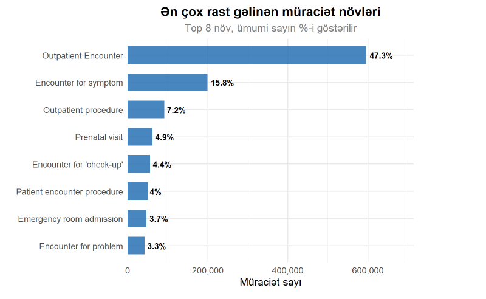

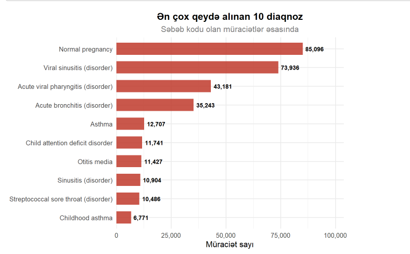

Bu hissədə pasiyentlərin tibbi müraciət davranışları analiz olunub. Yəni pasiyentlərin səhiyyə sisteminə daha çox hansı səbəblərlə müraciət etdiyi araşdırılıb.

Nəticələr göstərir ki, ən çox rast gəlinən müraciət növü Outpatient Encounter, yəni ambulator müraciətlər olub və ümumi müraciətlərin təxminən 47%-ni təşkil edib. Bu isə onu göstərir ki, pasiyentlərin böyük hissəsi xəstəxanaya yatış yox, gündəlik müayinə və tibbi xidmətlər üçün müraciət edir.

Daha sonra simptomla bağlı müraciətlər (Encounter for symptom) və ambulator tibbi prosedurlar (Outpatient procedure) gəlir. Təcili yardım şöbəsinə qəbul (Emergency room admission) göstəricisinin isə digər müraciət növlərinə nisbətən daha aşağı olduğu görünür.

Ən çox qeyd alınan diaqnoz isə Normal pregnancy, yəni normal hamiləliklə bağlı müraciətlər olub. Bundan sonra viral sinusit (Viral sinusitis) və kəskin viral boğaz iltihabı (Acute viral pharyngitis) kimi diaqnozlar gəlir. Bu isə datasetdə gündəlik və davamlı tibbi müraciətlərin üstünlük təşkil etdiyini göstərir.

Yaş və cins üzrə orta müraciət sayına baxdıqda isə xüsusilə 19–40 yaş aralığında qadın pasiyentlərdə müraciət göstəricisinin daha yüksək olduğu görünür. Bu nəticə prenatal xidmətlər və mütəmadi tibbi yoxlamalarla əlaqəli ola bilər.

Ümumilikdə analiz göstərir ki, səhiyyə sistemində əsas yük təcili hallardan çox, ambulator və davamlı tibbi xidmətlər üzərində formalaşır.

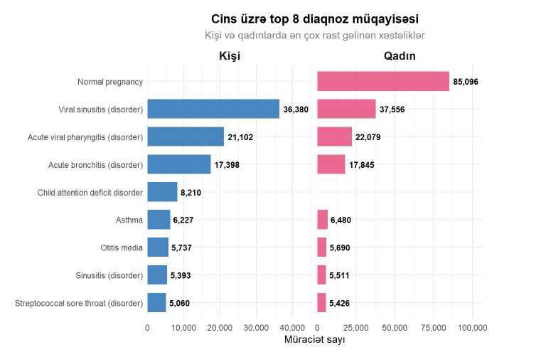

Kişi və qadın pasiyentlər arasında ən çox rast gəlinən diaqnozlar müqayisə edilmişdir. Analiz göstərir ki, hər iki cinsdə viral sinusit, kəskin viral faringit və kəskin bronxit kimi tənəffüs sistemi xəstəlikləri ən geniş yayılmış diaqnozlar sırasındadır. Qadın pasiyentlərdə normal hamiləlik diaqnozu müraciət sayı baxımından digər bütün diaqnozları əhəmiyyətli dərəcədə üstələyir və ümumi müraciət strukturuna ciddi təsir göstərir. Kişi pasiyentlərdə isə viral sinusit ən çox qeydə alınan diaqnozdur. Nəticələr göstərir ki, ümumi xəstəlik profili oxşar olsa da, cinsə məxsus tibbi xidmətlər müraciət statistikasında nəzərəçarpacaq fərqlər yaradır.

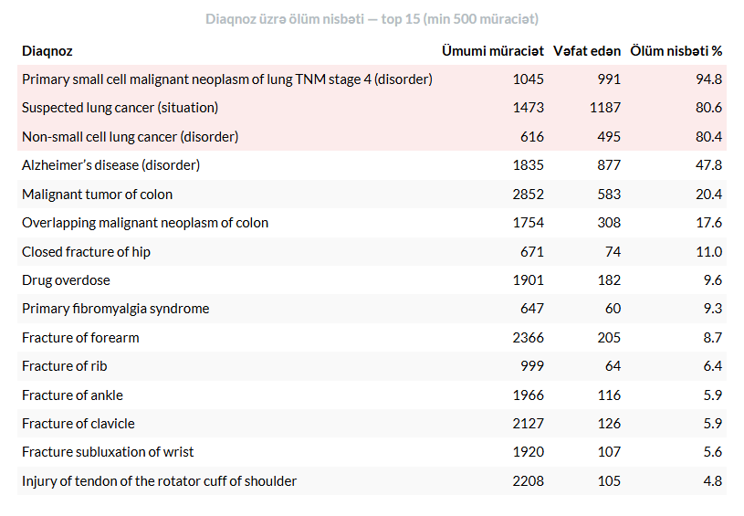

Minimum 500 müraciətə malik diaqnozlar arasında ölüm nisbəti üzrə ilk 15 xəstəlik təhlil edilmişdir. Nəticələr göstərir ki, ən yüksək ölüm göstəriciləri ağciyər xərçənginin müxtəlif formalarında müşahidə olunur. Xüsusilə IV mərhələ kiçik hüceyrəli ağciyər xərçəngində ölüm nisbəti 94.8%-ə çatır. Alzheimer xəstəliyi də yüksək ölüm göstəricisi ilə diqqət çəkir. Analiz göstərir ki, onkoloji və degenerativ xəstəliklər pasiyentlərin sağ qalma ehtimalına ən ciddi təsir göstərən diaqnozlar sırasındadır.

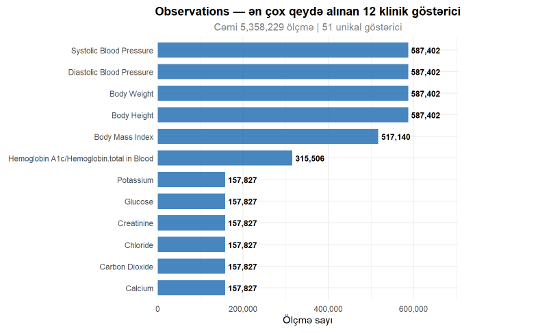

Sistemdə ən çox ölçülən klinik göstəricilər təqdim olunmuşdur. Nəticələrə əsasən arterial təzyiq (sistolik və diastolik), bədən çəkisi, boy və bədən kütlə indeksi ən çox qeydə alınan göstəricilərdir. Bu göstəricilərin yüksək tezliklə ölçülməsi onların pasiyentlərin ümumi sağlamlıq vəziyyətinin qiymətləndirilməsində əsas rol oynadığını göstərir. Həmçinin qlükoza və HbA1c kimi göstəricilərin geniş istifadə olunması metabolik və şəkərli diabetlə bağlı risklərin müntəzəm izlənildiyini göstərir. Analiz ümumi tibbi nəzarətdə həyati və laborator göstəricilərin prioritet yer tutduğunu təsdiqləyir.

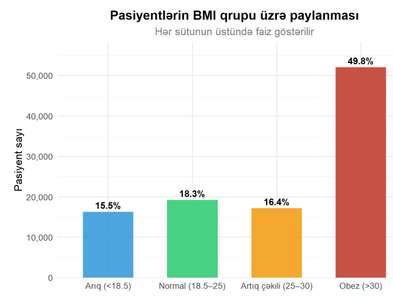

Bu hissədə BMI göstəricisi ilə xəstəliklər arasındakı əlaqə analiz olunub. Məqsəd fərqli çəki qruplarında hansı xəstəliklərin daha çox müşahidə olunduğunu müəyyən etmək idi.

İlk olaraq pasiyentlərin BMI üzrə paylanmasına baxdıqda ən böyük qrupun piylənmə, yəni obez kateqoriyasında olduğu görünür. Pasiyentlərin təxminən yarısı BMI göstəricisinə görə obez qrupuna daxildir.

Analiz nəticəsində obez pasiyentlərdə viral sinusit, bronxit və astma kimi respirator xəstəliklərin daha yüksək müşahidə olunduğu görünür. Bu nəticə artıq çəkinin immun sisteminə və tənəffüs problemlərinə təsiri ilə əlaqəli ola bilər.

Arıq pasiyentlərdə isə orta qulaq iltihabı (Otitis media) və bəzi infeksion xəstəliklərin daha çox müşahidə olunduğu görünür.

Normal BMI qrupunda ən çox rast gəlinən diaqnoz isə normal hamiləliklə bağlı müraciətlərdir. Bu isə həmin qrupun daha balanslı sağlamlıq göstəricilərinə sahib olduğunu göstərə bilər.

Ümumilikdə analiz göstərir ki, BMI göstəricisi müəyyən xəstəliklərin yaranma tezliyi ilə əlaqəli ola bilər və xüsusilə obez qrupunda respirator problemlər daha çox ön plana çıxır.

---

### Korrelyasiya Analizi

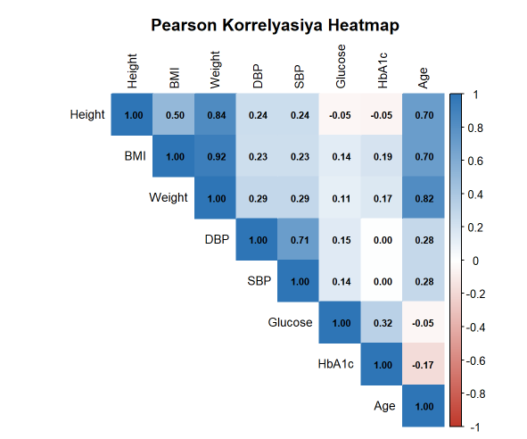

Pasiyentlərin klinik göstəriciləri arasındakı əlaqə Pearson korrelyasiya analizi vasitəsilə qiymətləndirilmişdir. Məqsəd müxtəlif sağlamlıq göstəricilərinin bir-biri ilə nə dərəcədə əlaqəli olduğunu müəyyən etməkdir.

Nəticələr göstərir ki, ən güclü əlaqə çəki ilə BMI arasında mövcuddur (0.92). Bu gözlənilən nəticədir, çünki insanın çəkisi artdıqca BMI göstəricisi də artır. Boy ilə çəki arasında da yüksək əlaqə müşahidə olunur (0.84).

Sistolik və diastolik qan təzyiqi göstəriciləri arasında 0.71 korrelyasiya müəyyən edilmişdir. Bu isə təzyiq göstəricilərinin adətən birlikdə dəyişdiyini göstərir.

Qlükoza ilə HbA1c arasında müsbət əlaqənin olması (0.32) diqqət çəkir. Başqa sözlə, qanda şəkər səviyyəsi yüksək olan pasiyentlərdə uzunmüddətli şəkər göstəricisi olan HbA1c də adətən yüksək olur.

Ümumilikdə analiz göstərir ki, datasetdəki göstəricilər tibbi baxımdan məntiqli əlaqələr nümayiş etdirir və əldə olunan nəticələr real həyatda gözlənilən sağlamlıq tendensiyaları ilə uyğunluq təşkil edir.

---

## Anomaliya Analizi

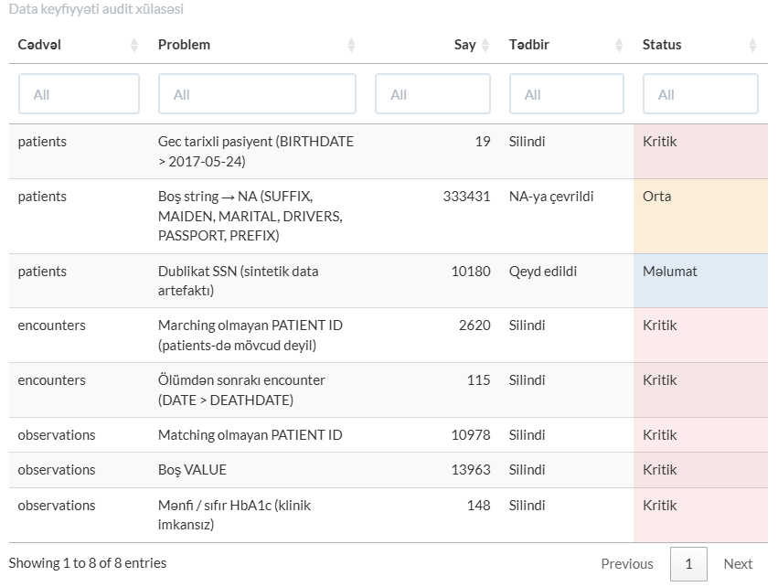

Dataset üzərində aparılmış data keyfiyyəti və aşkar edilmiş anomaliyalar təqdim olunmuşdur. Analiz zamanı gələcək tarixli doğum tarixləri, cədvəllər arasında uyğun gəlməyən pasiyent identifikatorları, ölüm tarixindən sonra qeydə alınmış müraciətlər, boş dəyərlər və klinik baxımdan mümkün olmayan HbA1c göstəriciləri müəyyən edilmişdir. Məlumatların etibarlılığını artırmaq məqsədilə kritik uyğunsuzluqlar datasetdən silinmiş, boş mətn dəyərləri isə NA formatına çevrilmişdir. Həmçinin sintetik məlumatlardan qaynaqlanan dublikat qeydlər sənədləşdirilmişdir. Aparılan təmizləmə prosesi sonrakı analizlərin daha dəqiq və etibarlı nəticələr verməsini təmin etmişdir.

---

## Hipotez Testləri

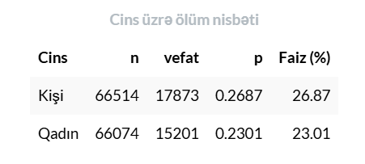

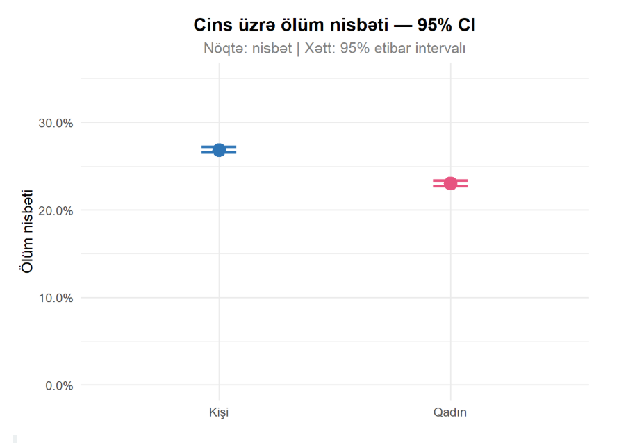

Bu hissədə kişi və qadın pasiyentlər arasında ölüm göstəriciləri müqayisə olunub və bu fərqin statistik olaraq əhəmiyyətli olub-olmadığı yoxlanılıb.

Nəticələr göstərir ki, kişilərdə ölüm göstəricisi təxminən 26.9%, qadınlarda isə 23% olub. Yəni, kişilərdə ölüm riski daha yüksək müşahidə olunub.

Burada Z-test metodundan istifadə olunub. Məqsəd bu fərqin təsadüfi olub-olmadığını müəyyən etmək idi. Analiz nəticəsində p-value göstəricisi çox kiçik çıxdığı üçün fərqin statistik olaraq əhəmiyyətli olduğu müəyyən olunub. Yəni kişi və qadınlar arasında ölüm göstəriciləri fərqli hesab edilir.

Aşağıdakı qrafikdə isə ölüm göstəriciləri və 95% etibar intervalı vizual şəkildə göstərilib. Qrafikdən də görünür ki, kişilərdə ölüm göstəricisi qadınlara nisbətən daha yüksəkdir.

Ümumilikdə analiz göstərir ki, gender faktoru ölüm riski ilə əlaqəli dəyişənlərdən biri kimi qiymətləndirilə bilər.

Burada məqsəd kişi və qadın pasiyentlər arasında ölüm göstəricilərində real fərq olub-olmadığını yoxlamaq idi.

Çünki faizlər fərqli görünə bilər, amma bu fərqin həqiqətən əhəmiyyətli olub-olmadığını ayrıca yoxlamaq lazımdır.

Analiz nəticəsində gördük ki, kişilərdə ölüm göstəricisi qadınlardan daha yüksəkdir və bu fərq təsadüfi deyil. Yəni gender faktorunun ölüm riski ilə müəyyən əlaqəsi olduğu müşahidə olunur.
Bu cür analizlərin praktiki faydası risk qruplarını müəyyən etməyə və səhiyyə planlaşdırılmasında hansı qruplara daha çox nəzarət tələb edildiyini anlamağa kömək edir.

.png)

.png)

Statistik əhəmiyyətlilik yoxlanılmışdır.

---

## Nəticələr və Tövsiyələr

Əldə olunan nəticələr səhiyyə göstəricilərinin daha yaxşı başa düşülməsinə və risk faktorlarının müəyyən edilməsinə imkan verir.
